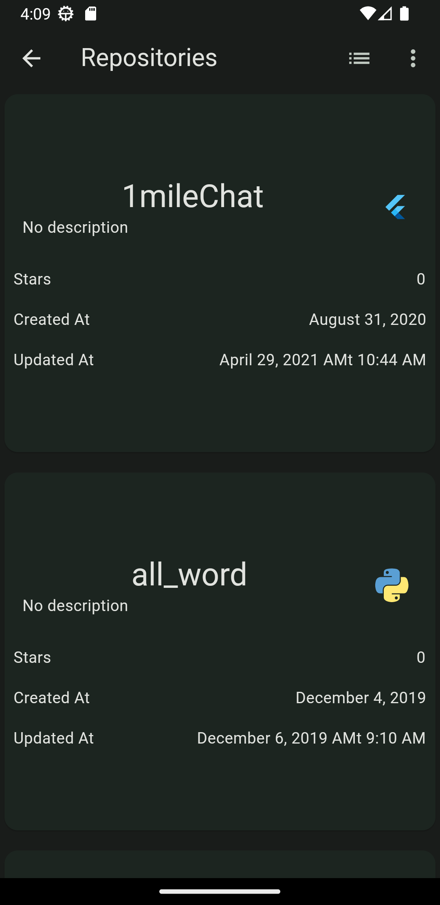
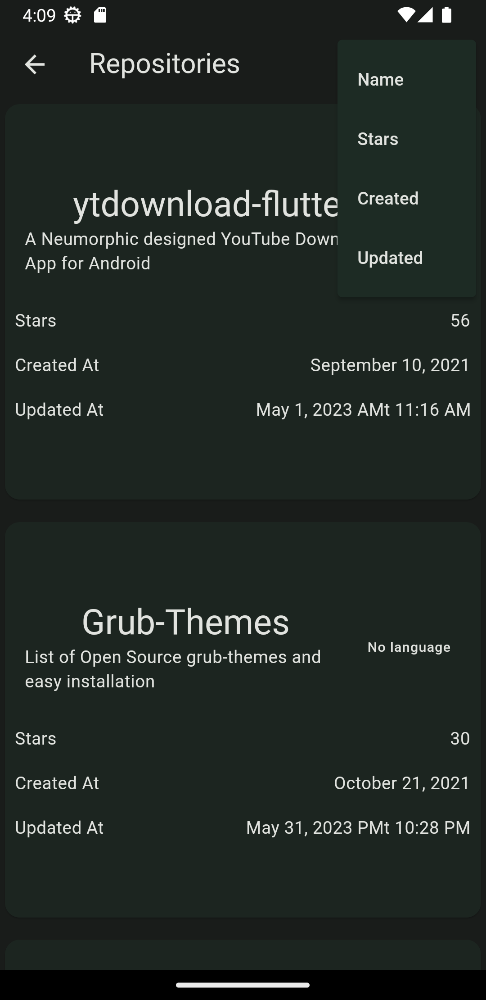
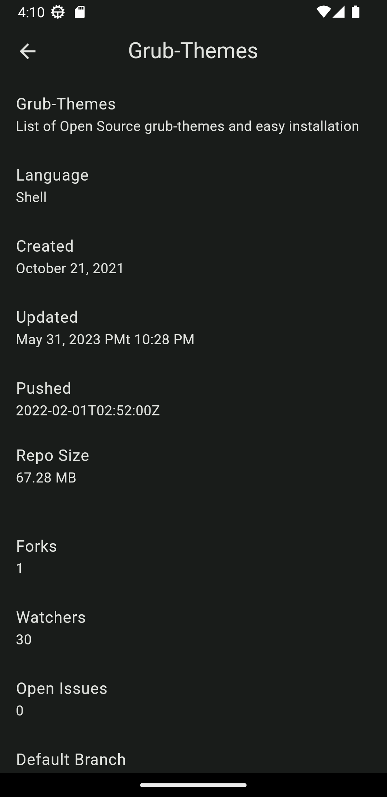

# github API 

A Flutter Project using the Github API to search for users and repositories.

## There's a no special requirements to run this project, just clone it and run it on your device or emulator.

## This project was made using the following technologies:

- [Flutter](https://flutter.dev/)
- [Flutter Bloc](https://bloclibrary.dev/) as State Management
- [Json Annotation](https://pub.dev/packages/json_annotation) to generate the models
- [http](https://pub.dev/packages/http) to make the api requests
- [animations](https://pub.dev/packages/animations) to make few animations
- [intl](https://pub.dev/packages/intl) to format the date

## To run this project:

- Clone this repository
- Run `flutter pub get` to install the dependencies
- Run `flutter run` to start the app

## Here's some screenshots of the app:
<!-- show screenshot which are in the screenshot fodler -->

## Goto Release Page to download the apk file